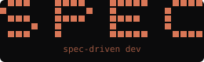
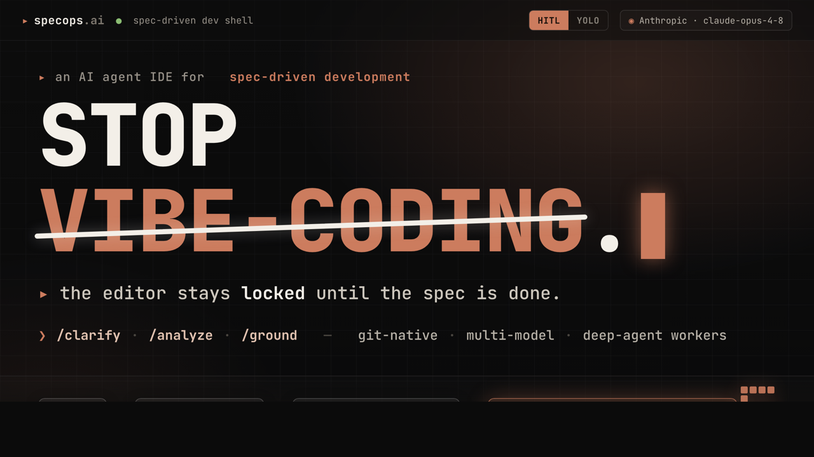
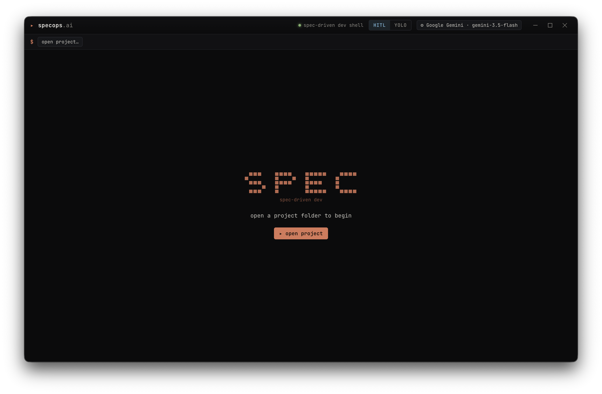
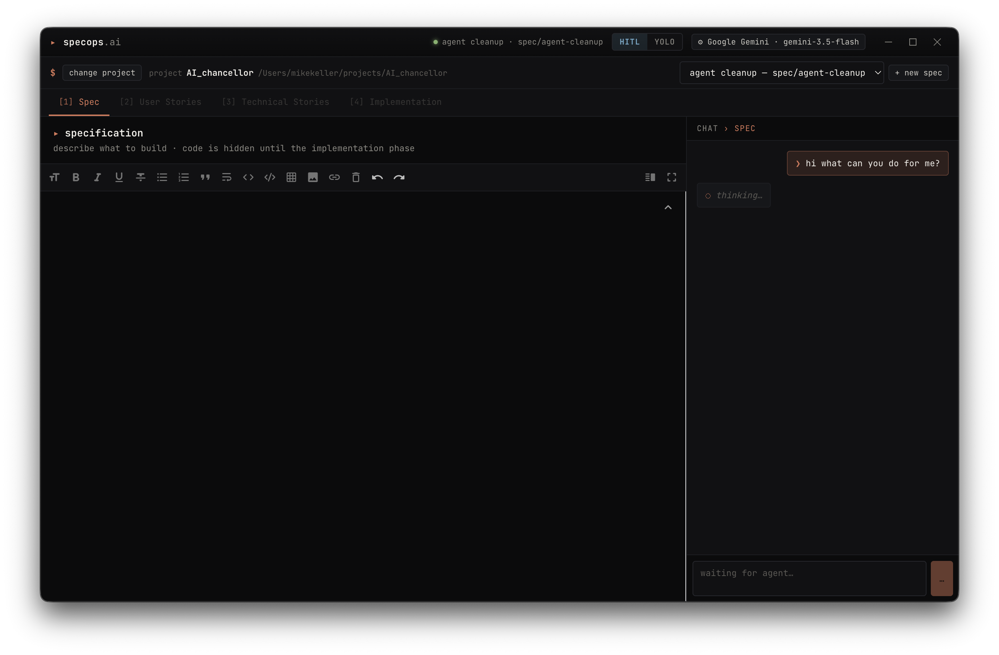

<p align="center">
  
</p>

# SpecOps AI

A desktop IDE for **Spec-Driven Development** with an integrated AI agent harness
built on [`deepagents`](https://www.npmjs.com/package/deepagents) (LangChain).
The app forces the developer through four ordered phases — Spec → User Stories →
Technical Stories → Implementation — and only unlocks the code editor in the
last phase. Every chat, Worker and test-loop runs through the same agent
harness, against any of the configurable model providers
(Anthropic, OpenAI, Google Gemini, AWS Bedrock, OpenCode, or local Ollama).

Three pillars make the workflow more than a chat wrapper:

- **Project context.** Every agent is grounded by a per-project
  `.specops/constitution.md` (your engineering principles — binding for all
  agents) and a generated `.specops/codebase.md` (architecture, conventions,
  commands — produced by the *analyze codebase* action). This is what makes
  SpecOps usable on large **brownfield** projects: specs and stories reference
  real files and real conventions instead of inventing structure.
- **Structured phase playbooks + slash actions.** Each phase agent follows a
  Spec Kit-style template (`FR-n` requirements, `US-n` stories with priorities
  and Given/When/Then criteria, `TS-n` stories with dependencies and file
  lists) and marks ambiguity as `[NEEDS CLARIFICATION]` instead of guessing.
  In any phase chat you can run `/clarify` (targeted questions), `/analyze`
  (cross-artifact consistency audit), or `/ground` (verify the artifact
  against the real code).
- **Git-native collaboration.** Each spec lives on its own branch; chats and
  worker state are stored *inside the spec folder* so they travel with the
  branch. With auto-commit on (default), artifact edits and completed worker
  tasks become labelled commits, and the project bar has one-click
  sync (fetch + rebase + push). Selecting a spec checks out its branch.

> **Terminology note.** In this repo, a **Worker** is our ephemeral per-story /
> per-task deep-agent instance. It is *not* the same thing as a deepagents
> `SubAgent`. A deepagents `SubAgent` is the generic primitive the library
> exposes (`plan`, `explore`, `test-author`) that a Worker spawns internally
> via the built-in `task` tool for context-isolated sub-work. Read this
> paragraph every time the two words blur together.

---

## Demo

<p align="center">
  <a href="https://youtu.be/v8diYicjxjY">
    
  </a>
</p>

<p align="center">
  <a href="https://youtu.be/v8diYicjxjY">▶ Watch the demo on YouTube</a>
</p>

---

## Screenshots

<p align="center">
  
</p>

<p align="center">
  
</p>

---

## Table of Contents

1. [Interface design](#interface-design)
2. [What the chatbot does in each phase](#what-the-chatbot-does-in-each-phase)
3. [Agent modes (HITL vs YOLO)](#agent-modes-hitl-vs-yolo)
4. [Testing system](#testing-system)
5. [Project / spec layout on disk](#project--spec-layout-on-disk)
6. [Technical architecture](#technical-architecture)
7. [File-by-file walkthrough](#file-by-file-walkthrough)
8. [Build & run](#build--run)

---

## Interface design

The UI takes visual cues from terminal-first dev tools — Claude Code and
OpenCode in particular — and leans into a monospace, dense, "prompt line"
aesthetic rather than a conventional dashboard look.

### Design tokens

All colors, type, and spacing live as CSS custom properties at the top of
[styles.css](src/renderer/styles.css#L1-L54):

- **Type** — [JetBrains Mono](https://www.jetbrains.com/mono/) everywhere in the
  shell (`--font-mono`), [Inter](https://rsms.me/inter/) reserved for rendered
  markdown prose inside the preview pane (`--font-sans`). Font scale runs
  `11 / 12 / 13 / 14 / 16 px`.
- **Surfaces** — four warm-black layers (`--bg-0` … `--bg-3`) plus a
  `--bg-overlay` for the settings modal, with matching
  `--border-subtle / --border / --border-strong` dividers.
- **Foreground** — four tiers (`--fg-0` primary through `--fg-3` faint) on a
  warm off-white so the mono type does not read as clinical blue-white.
- **Accent — Claude coral.** `--accent: #d97757` is the single brand hue: it
  drives the primary button, the focus ring (`input:focus` → accent border),
  active phase tab underlines, the story-list active indicator, user chat
  bubbles, markdown `h1/h3` headings, and the brand glyph in the header.
- **Semantic palette** — ANSI-flavored `--ok / --warn / --danger / --info /
  --magenta`, each with a matching `-soft` variant for soft-tinted backgrounds.
  These back the `.badge`, `.notice`, `.status-text`, `.iter`, and
  `.task-item .task-status.*` components.

The palette is tuned warm on purpose — every bg and fg has a subtle yellow
cast so the coral accent reads as "same family" rather than as a bolt-on
highlight on cold grey.

### Motifs

- **Prompt glyphs.** `▸` marks section titles, the brand, and editor headers;
  `$` prefixes the project bar; `❯` prefixes user chat messages; `●` prefixes
  agent messages; `◌` pulses while the agent is thinking
  ([styles.css @keyframes pulse](src/renderer/styles.css)).
- **ASCII banner.** The empty state renders a hand-drawn
  `▗▄▖  ▗▄▄▖ ▗▄▄▄▖ ▗▄▄▖` banner in coral ([App.tsx EmptyState](src/renderer/App.tsx))
  instead of a graphic, reinforcing the "this is a terminal, not a dashboard"
  frame.
- **Sharp corners, thin dividers.** Radius is either `4px` (`--radius`) or
  `6px` (`--radius-lg`) and dividers are strictly 1px. No drop shadows except
  under the settings modal.
- **Frameless window, custom chrome.** The Electron window is frameless; the
  app header is a drag region (`-webkit-app-region: drag`) and
  `<WindowControls />` ([App.tsx](src/renderer/App.tsx)) renders the
  minimize / maximize / close triplet as inline SVG buttons with a coral-less
  hover — the close button flips to `--danger` on hover to match the rest of
  the chrome's color language.
- **Subtle animations.** 120 ms hover transitions on buttons/inputs; the
  thinking indicator is the only animation that loops.

### Component class catalog

All styling is class-driven. The reusable classes, all defined in
[styles.css](src/renderer/styles.css):

| Class(es) | Purpose |
|---|---|
| `.app`, `.app-header`, `.header-meta`, `.header-status`, `.brand` | Top-level shell and frameless drag region. |
| `.btn`, `.btn-primary`, `.btn-success`, `.btn-danger`, `.btn-ghost`, `.btn-icon`, `.btn-sm` | The one button system. Primary is coral; success/danger use soft semantic tints. |
| `.mode-toggle` (+ `.active.hitl` / `.active.yolo`) | HITL/YOLO segmented toggle in the header. |
| `.projectbar` (+ `.prompt-prefix`, `.project-info`) | The shell-prompt-styled project selector row. |
| `.phasenav` (+ `.step-num`, `.active`) | Phase tabs with step numbers in `[1]` brackets. |
| `.editor-header` (+ `.title`, `.subtitle`) | The `▸ title / subtitle` header above each artifact editor. |
| `.code-editor` | The monospace textarea used for the legacy code view. |
| `.chat`, `.chat-header`, `.chat-log`, `.chat-msg.user / .agent / .thinking`, `.chat-input-row`, `.chat-empty` | All chat surfaces — phase chat and Worker chat both use these. |
| `.refs-collapsed`, `.refs-drawer`, `.refs-header`, `.refs-tabs`, `.refs-content` | Upstream-references side drawer. |
| `.tabs` | The implementation-view tab strip (`workers / integration tests / test loop / code notes`). |
| `.story-list` (+ `.story-id`, `.story-title`, `.story-meta`) | Left sidebar of decomposable stories. Active item gets a coral left border. |
| `.story-workspace`, `.story-head`, `.story-toolbar`, `.task-list`, `.task-item` (+ `.task-status.pending / .in-progress / .done`) | Per-story workspace — head, action toolbar, decomposed task list. |
| `.badge.hitl / .yolo / .ok / .warn / .danger / .info / .magenta` | Uppercase mono pills used for framework labels, iteration results, and mode indicators. |
| `.notice.info / .ok / .warn / .danger` | Banner for generated-test results, merge outcomes, HITL approval prompts, etc. |
| `.card`, `.iter`, `.iter-head`, `.test-row`, `pre.code-block` (+ `.failure`) | Test-loop iteration cards and code-block output. |
| `.overlay`, `.modal`, `.modal-header / -body / -side / -content / -footer`, `.field`, `.field-label`, `.option-card`, `.section-title`, `.section-subtitle` | Settings modal. |
| `.empty-state` (+ `.ascii`, `.msg`) | ASCII-banner empty state. |
| `.window-controls`, `.wc-btn`, `.wc-close` | Frameless-window chrome. |

The legacy `MarkdownEditor` (wrapper around `react-markdown-editor-lite`) is
themed with a scoped `<style>` block inside
[MarkdownEditor.tsx](src/renderer/MarkdownEditor.tsx), reading from the same
CSS variables so the embedded editor visually merges with the rest of the
shell (caret is coral, `h1` gets the `▸` prefix, `blockquote` gets a coral
left bar, `code` uses `--bg-2`, etc.).

### Changing the look

Because every color, font, and radius is a CSS variable at
[styles.css:5](src/renderer/styles.css#L5), the most common retheming
task — re-skinning to a different accent — is a one-line change to `--accent`,
`--accent-soft`, `--accent-strong`, and `--accent-fg`. Surface/foreground
adjustments are likewise one `var(...)` edit away and propagate everywhere
including the markdown preview.

---

## Project context — constitution & codebase analysis

Two project-wide context files live under `<project>/.specops/` and are
injected (size-capped) into **every** agent prompt — phase chats, workers,
the reviewer, the test-fix loop, and external CLI agents:

- **`constitution.md`** — engineering principles, created from a starter
  template on first open ([projectContext.ts](src/main/projectContext.ts)).
  Edit it freely; agents treat it as binding ("smallest change that satisfies
  the acceptance criteria", "follow existing conventions", …).
- **`codebase.md`** — a generated onboarding document (Overview / Stack /
  Architecture / Conventions / Commands / Gotchas) produced by the
  **analyze codebase** button in the project bar or the `/codebase` chat
  command. The analysis agent explores the repository with filesystem tools
  (delegating sweeps to the `explore` subagent) and writes the document
  itself. Re-run it whenever the codebase shifts; the button shows when it
  was last generated.

Both files are committed, so the whole team — and every agent — shares the
same grounding. On a brownfield repo, run **analyze codebase** once before
writing the first spec.

## Slash actions

Available in every phase chat, as `/command` text or via the chips above the
input ([Chat.tsx](src/renderer/Chat.tsx)). Each expands to a focused
instruction block server-side ([agent.ts](src/main/agent.ts)); the transcript
keeps the short command. Add free text after the command to focus it
(`/analyze just the auth stories`).

| Action | What it does |
|---|---|
| `/clarify` | Finds ambiguities in the current artifact, inserts `[NEEDS CLARIFICATION]` markers at the exact spots, and asks ≤5 targeted questions (each with a proposed default). |
| `/analyze` | Read-only consistency audit across spec ↔ user stories ↔ technical stories: coverage gaps (FR → US → TS), contradictions, terminology drift, constitution violations. Reports Critical/Warning/Info findings; never edits files. |
| `/ground` | Verifies every claim in the artifact against the real codebase (paths, APIs, behaviors) and reports mismatches with file:line evidence. |
| `/codebase` | Runs the project-level codebase analysis (same as the project-bar button) and refreshes `.specops/codebase.md`; the chat replies with the analysis' Overview. Unlike the other commands it does not run through the phase agent. |

## What the chatbot does in each phase

The UI shows **only the artifact for the current phase** ([App.tsx:218-241](src/renderer/App.tsx#L218-L241)).
Each phase has its own chat history (`messagesByPhase`, [App.tsx:31-36](src/renderer/App.tsx#L31-L36))
and its own system prompt that instructs the agent what to produce.

All four phases share the same machinery:
[`runAgentTurn`](src/main/agent.ts#L182-L225) builds a per-phase system prompt,
runs a deepagent, and returns `{ reply, artifact? }`.

Two capabilities are wired into every phase chatbot:

- **Real codebase access.** Each turn builds a `FilesystemBackend` rooted at
  the project root ([agent.ts:197-200](src/main/agent.ts#L197-L200)), giving the
  agent `ls`, `read_file`, `write_file`, `edit_file`, `glob`, and `grep` over
  the entire repo. This is the same backend the per-story Worker chat uses,
  so the phase agent can ground its spec/story revisions in the real code
  (e.g. grep for IPC channels before writing a spec section about them).
- **Disk-diff artifact persistence.** Before the turn runs, the UI's current
  artifact content is flushed to disk via
  [`syncArtifactToDisk`](src/main/agent.ts#L158-L169); after the turn, the same
  file is re-read via [`readArtifactFromDisk`](src/main/agent.ts#L171-L180) and
  compared against that baseline. If the content differs, `runAgentTurn`
  returns `{ artifact: { key, content } }` and the renderer flushes it through
  the existing `writeArtifact` path ([App.tsx:122-127](src/renderer/App.tsx#L122-L127)).
  The system prompt instructs the agent to call `write_file` on the artifact's
  virtual path with the **full** updated markdown when it wants to persist a
  change, and to leave the file untouched for pure questions.

The agent's final assistant message is returned verbatim as the chat `reply`.
There is no XML fencing — the old `<artifact>` / `<reply>` protocol has been
replaced end-to-end by the pre/post disk-diff on the artifact file.

**Live streaming.** While the turn runs, the chat shows everything the deep
agent emits in real time — intermediate reasoning, the reply forming token by
token, and every tool call (`read_file`, `grep`, `write_file`, the `task`
delegation, …) with its arguments and result. `runAgentTurn`
([agent.ts](src/main/agent.ts)) drives the agent with LangGraph's
`stream({ streamMode: ["messages", "tools", "values"], subgraphs: true })`
instead of `invoke`, translating the raw stream into a small
[`AgentStreamEvent`](src/shared/api.ts) union (`thinking` / `text` /
`tool-start` / `tool-end`, each tagged with a subgraph `depth` so nested
subagent work is surfaced too). Events are pushed over the `agent:event` IPC
channel (broadcast in [main.ts](src/main/main.ts), subscribed via
`onAgentEvent` in [preload.ts](src/preload/preload.ts)) and rendered as a live
"agent activity" panel in [Chat.tsx](src/renderer/Chat.tsx). Tool calls render
with a schema-aware one-line summary (`read_file <path>`, `grep "<pattern>"`,
…) that expands to the exact input/output; `write_todos` is shown as a status
checklist rather than raw JSON. Each turn carries
a renderer-generated `turnId` so events route to the right phase; the final
`reply` is derived from the last `values` state snapshot exactly as `invoke`
would have returned it.

**Trace persistence.** When the turn finishes, the captured trace is attached
to the agent turn as `AgentTurn.activity` ([api.ts](src/shared/api.ts)) and
saved to the spec's own `.specops/chats.json` alongside the reply, so
reopening a spec — or pulling its branch on another machine — replays the
thinking + tool calls (collapsed by default under each reply). Tool outputs are
capped before persisting to keep the file small. Chats from older builds
(stored app-locally) are migrated into the spec folder on first read.

**Thinking is configurable per provider.** Each provider has a thinking control
in Settings ([Settings.tsx](src/renderer/Settings.tsx)) whose shape is declared
by `ProviderDescriptor.thinking` ([api.ts](src/shared/api.ts)): a token budget
for Anthropic / Gemini, a low/medium/high effort for OpenAI reasoning models,
or a plain on/off for Ollama. [`buildChatModel`](src/main/models.ts) maps the
saved `ThinkingConfig` to each SDK's native option (`thinking.budget_tokens`,
`thinkingConfig.thinkingBudget`, `reasoningEffort`, `think`). With Anthropic /
Gemini thinking on, the reasoning streams straight into the activity panel
above.

### 1. Spec phase

- **What you see:** the `spec.md` markdown editor on the left and a chat panel on the right ([PhaseView.tsx:13-23](src/renderer/PhaseView.tsx#L13-L23)).
- **Code is hidden.** The implementation tab is not even reachable.
- **Chatbot job** (playbook in [agent.ts](src/main/agent.ts) `PHASE_CONFIG`):
  - Produce a testable Specification with a fixed structure: Summary, Context
    (current behavior + affected areas, for brownfield changes), Goals,
    Non-goals, **numbered functional requirements (`FR-1`, `FR-2`, …)**,
    Constraints, Edge cases, Open questions.
  - **Never guess**: ambiguity becomes `[NEEDS CLARIFICATION: question]`
    (max 5, most impactful first) and the questions are asked in the reply.
  - **Do not** include implementation details, user stories, or code.
  - Keep `FR-n` IDs stable so later phases can reference them.
- **Context fed in:** the project constitution + codebase analysis, and the current spec markdown.

### 2. User Story phase

- **What you see:** the `user-stories.md` editor + chat ([PhaseView.tsx:24-34](src/renderer/PhaseView.tsx#L24-L34)).
- **Chatbot job:**
  - Derive **User Stories** from the Spec: `## Epic: …` groups containing
    `### US-1: <title>` headings, each with the standard story line, a
    `**Priority:** P1|P2|P3`, `**Covers:** FR-x` traceability, and
    Given/When/Then `**Acceptance criteria**`.
  - Every `FR` must be covered by at least one story; uncovered FRs are called out.
- **Context fed in:** project context + the Spec.

### 3. Technical Story phase

- **What you see:** the `technical-stories.md` editor + chat ([PhaseView.tsx:35-45](src/renderer/PhaseView.tsx#L35-L45)).
- **Chatbot job:**
  - Derive **Technical Stories** (`## TS-1: <title>`) from the User Stories,
    grounded in the real codebase: each carries `**Covers:** US-x`,
    `**Depends on:** TS-y|none` (independent stories can run in parallel),
    `**Files:**` (verified real paths, `(new)` for additions), verifiable
    acceptance criteria, and an `### Example` code snippet of the key
    interface/stub the story builds toward.
  - Stories are small (≈ half a day), self-contained, and ordered so
    dependencies come first — each becomes a Worker task.
- **Context fed in:** project context + Spec **and** User Stories.

### 4. Implementation phase

This is the only phase where the code becomes visible, and it is also the
richest UI. It does **not** use `PhaseView` — it switches to the
[`ImplementationView`](src/renderer/ImplementationView.tsx) component
([App.tsx:221-229](src/renderer/App.tsx#L221-L229)), which exposes four tabs:

- **`workers`** — the per-story Worker workspace.
- **`integration`** — integration-test generation per User Story.
- **`testloop`** — the autonomous test-fix loop.
- **`code`** — a minimal markdown/code editor for `code.md`.

For each Technical Story (parsed from `technical-stories.md` via
[`parseTechnicalStories`](src/renderer/technical-stories.ts)) the agent can:

1. **Decompose the story** — call
   [`decomposeStory`](src/main/worker.ts). A Worker is given an `emit_tasks`
   tool requiring 2–8 task chunks with `{id, title, description}`. The chunks
   are stored in `<spec>/.specops/workers.json` (legacy `subagents.json` files
   are auto-migrated on read).
2. **Chat with a Worker** scoped to that one story
   ([`workerChat`](src/main/worker.ts)). The Worker has a completely separate
   context window and is given **real filesystem tools** (`ls`, `read_file`,
   `write_file`, `edit_file`, `glob`, `grep`) rooted at the project root via
   deepagents' `FilesystemBackend`. It is also wired with the generic
   deepagents `SubAgent`s (`plan`, `explore`, `test-author`) so it can delegate
   survey / planning / test-writing passes through the built-in `task` tool
   for context isolation.
3. **Run a single decomposed task** — [`runWorkerTask`](src/main/worker.ts)
   prompts the Worker with a focused per-task message and optionally
   auto-marks the task as `done` (`autoComplete=true` in YOLO mode).
4. **Generate unit tests** for the story
   ([`generateUnitTests`](src/main/worker.ts)).
5. **Generate integration tests** for any User Story
   ([`generateIntegrationTests`](src/main/worker.ts)).
6. **Start the autonomous test loop** — see [Testing system](#testing-system).

---

## Agent modes (HITL vs YOLO)

The mode is a single setting (`agentMode`) saved in `settings.json`
([settings.ts:28-32](src/main/settings.ts#L28-L32)) and toggled in the header
([App.tsx:174-184](src/renderer/App.tsx#L174-L184)).

- **HITL — Human-in-the-loop (default).** Each Technical Story task has to be
  approved before the Worker runs it. Status flips: `pending →
  in-progress` only when you click; the agent must pause for explicit
  confirmation in the UI before touching files.
- **YOLO — Autonomous.** The Implementation view can chain through every
  decomposed task of every story without confirmation, marking each as `done`
  when the Worker reply comes back (`autoComplete=true` is forwarded to
  [`runWorkerTask`](src/main/worker.ts)). Designed for unattended
  overnight runs.

The mode is read by `ImplementationView` and used to decide whether to gate
runs behind `pendingApproval`
([ImplementationView.tsx:82-87](src/renderer/ImplementationView.tsx#L82-L87)).

---

## Testing system

### Unit tests
- Generated **per Technical Story** by [`generateUnitTests`](src/main/worker.ts).
- Output path: `tests/unit/<storyId>.test.md`.
- The Worker gets `write_file` access via `FilesystemBackend` and is
  instructed to write the test spec **itself**, then reply with a one-sentence
  summary. It may delegate the focused authoring pass to the generic
  `test-author` deepagents `SubAgent` via the built-in `task` tool.

### Integration tests
- Generated **per User Story** by [`generateIntegrationTests`](src/main/worker.ts).
- Framework auto-detection:
  - regex hits on `react|next.js|vue|svelte|angular|web app|browser|playwright`
    → **Playwright** (TypeScript) → output at `tests/integration/<storyId>.spec.ts`.
  - otherwise → **generic** Given/When/Then markdown at
    `tests/integration/<storyId>.test.md`.
- The Playwright prompt section hard-constrains the agent to import only
  `@playwright/test`, use semantic locators, and emit valid TypeScript that
  passes `tsc --noEmit`.

### Autonomous test loop
Implemented in [`test-loop.ts`](src/main/test-loop.ts). Lifecycle:

1. **Discover tests** — walk `tests/` recursively for `*.{test,spec}.{ts,tsx,js,jsx,md}`
   ([test-loop.ts:81-101](src/main/test-loop.ts#L81-L101)).
2. **Run each test** with the right command
   ([test-loop.ts:124-133](src/main/test-loop.ts#L124-L133)):
   - `*.spec.ts` / `*.spec.tsx` → `npx --yes playwright test … --reporter=line`
   - `*.test.{ts,tsx,js,jsx}` → `npx --yes vitest run …` with a Jest fallback
   - `*.test.md` → treated as documentation, marked passed and skipped
3. **If anything failed, run the fix-agent** ([test-loop.ts:219-264](src/main/test-loop.ts#L219-L264)).
   The agent is given a `verdict` tool (`fix-code | fix-test`) that it must
   call exactly once before applying any change, plus the same filesystem tools
   as the Workers. Decision rules ([test-loop.ts:198-202](src/main/test-loop.ts#L198-L202)):
   - test matches the Spec → fix the **code**
   - test contradicts the Spec → fix the **test**
4. Repeat for up to `maxIterations` (default 5,
   [test-loop.ts:33](src/main/test-loop.ts#L33)).
5. Status streams live to the renderer via the `testloop:update` IPC channel
   ([main.ts:139-143](src/main/main.ts#L139-L143)).

State is exposed as `TestLoopState` ([api.ts:159-164](src/shared/api.ts#L159-L164))
with statuses `idle | running-tests | analyzing | fixing | passed |
max-iterations | error | stopped`.

---

## Project / spec layout on disk

When you open a folder, the app initializes a git repo if needed
([project.ts](src/main/project.ts)), creates `specs/`, and scaffolds the
project context. Each spec lives in its own folder with its own git branch:

```
<your-project>/
├── .git/
├── README.md                       # auto-created on first init
├── .specops/
│   ├── constitution.md             # project principles — injected into every agent
│   └── codebase.md                 # generated codebase analysis (analyze codebase button)
├── specs/
│   ├── my-first-spec/              # one folder per spec
│   │   ├── .specops.json           # SpecInfo metadata (id, name, branch, createdAt)
│   │   ├── .specops/
│   │   │   ├── workers.json        # decomposed tasks + worker chat per story
│   │   │   └── chats.json          # per-phase agent chats incl. traces — shared via git
│   │   ├── spec.md
│   │   ├── user-stories.md
│   │   ├── technical-stories.md
│   │   └── code.md
│   └── another-spec/…
└── tests/
    ├── unit/<storyId>.test.md
    └── integration/<storyId>.spec.ts | .test.md
```

- A new spec creates a branch `spec/<slug>`; slugs are made unique by
  suffixing `-2`, `-3`, ….
- The four artifact files map 1:1 to `ArtifactFiles` keys
  ([api.ts](src/shared/api.ts) `ARTIFACT_FILENAMES`).
- Multiple specs can be developed in parallel; each gets its own branch and
  folder, and **selecting a spec in the project bar checks out its branch**
  (skipped with a warning when the tree is dirty — never forced).

### Git collaboration

Everything an agent produces lives in the repo, so the unit of collaboration
is a plain git branch:

- **Auto-commit (default on, Settings → git collaboration).** Artifact edits
  by the phase agent become `docs(<spec>): update spec.md (spec agent)`
  commits scoped to the spec folder; a completed worker task commits the
  working tree as `feat(TS-2): <task title> [TS-2.1, review: approved]`;
  context scaffolding and codebase analyses are committed as `chore:` commits.
- **Sync.** The `⇅ sync` button in the project bar runs
  fetch + `pull --rebase` + `push -u` for the current branch and reports the
  outcome inline. It refuses to run on a dirty tree rather than stashing
  behind your back.
- **Shared state.** Phase chats (with traces) and worker state ride inside
  `specs/<id>/.specops/`, so a teammate who pulls the branch sees the full
  conversation and task progress that produced the code.
- **Merge gate.** The test-loop panel's merge flow still verifies green
  tests, a clean tree, and an up-to-date branch before `merge --no-ff` into
  `main`.

---

## Technical architecture

The app is a standard three-process Electron app:

```
┌─────────────────────────────────────────────────────────────────┐
│ Renderer  (React 18 + Vite)                                     │
│  src/renderer/*.tsx                                             │
│   App ─ ProjectBar ─ PhaseNav ─ PhaseView | ImplementationView  │
│                                  └─ Chat (per-phase)            │
│                                                                 │
│   talks to main only via window.specops.* (typed by SpecOpsApi) │
└────────────────────────────┬────────────────────────────────────┘
                             │ contextBridge.exposeInMainWorld
┌────────────────────────────┴────────────────────────────────────┐
│ Preload  (src/preload/preload.ts)                               │
│   thin ipcRenderer.invoke wrappers + onTestLoopUpdate listener  │
└────────────────────────────┬────────────────────────────────────┘
                             │ ipcMain.handle (project:*, agent:*,│
                             │ worker:*, testloop:*, settings:*)  │
┌────────────────────────────┴────────────────────────────────────┐
│ Main  (Node, Electron)                                          │
│  main.ts        IPC wiring + window creation                    │
│  project.ts     git init, branch-per-spec, artifact read/write  │
│  settings.ts    settings.json (provider config + agentMode)     │
│  models.ts      Anthropic/OpenAI/Google/Ollama → BaseChatModel  │
│  deepagentsDeps.ts  cached ESM loader for deepagents + LC core  │
│  agent.ts       phase chatbot (FS tools + disk-diff artifact)   │
│  worker.ts      per-story decomposition / chat / task / tests   │
│  workerSubagents.ts generic deepagents SubAgents (plan/explore) │
│  test-loop.ts   discover → run → analyze → fix loop             │
│  utils.ts       shared: projectRoot, lastAssistantText, isAbort │
└─────────────────────────────────────────────────────────────────┘
                             │
                             ▼
                      deepagents (LangChain)
                             │
                             ▼
              Anthropic | OpenAI | Google | Ollama
```

Two patterns are worth calling out:

### ESM-from-CJS dynamic loader

`deepagents` and `@langchain/*` are pure ESM, but the Electron main process is
compiled to CommonJS (`tsconfig.main.json` → `dist/main/*.js`). All main-side
files that need them use a single cached loader in
[`deepagentsDeps.ts`](src/main/deepagentsDeps.ts):

```ts
export function loadDeps(): Promise<Deps> {
  if (!cached) {
    cached = Promise.all([
      Function('return import("deepagents")')() as Promise<typeof DeepAgents>,
      Function('return import("@langchain/core/messages")')() as Promise<typeof Messages>,
      Function('return import("@langchain/core/tools")')() as Promise<typeof Tools>,
    ]).then(([deepagents, messages, tools]) => ({ deepagents, messages, tools }));
  }
  return cached;
}
```

`Function('return import("…")')()` evaluates a real dynamic `import()` at
runtime, which TypeScript otherwise lowers to `require()` and breaks ESM. The
result is cached so we pay the import cost once.

### Provider abstraction

[`buildChatModel`](src/main/models.ts#L13-L42) takes a `ProviderConfig` and
returns a LangChain `BaseChatModel`. The four supported providers are described
declaratively in [`PROVIDER_DESCRIPTORS`](src/shared/api.ts#L199-L235), which
the Settings UI uses to render forms and defaults. The active provider is
resolved on every agent invocation via [`getActiveProvider`](src/main/settings.ts#L85-L88),
so changing it in Settings takes effect on the next message.

---

## File-by-file walkthrough

### Main process — `src/main/`

| File | Purpose |
|---|---|
| [main.ts](src/main/main.ts) | Creates the `BrowserWindow` and registers every `ipcMain.handle` for `project:*`, `spec:*`, `agent:*`, `worker:*`, `testloop:*`, `settings:*`. Also rebroadcasts test-loop state to all renderer windows ([main.ts:139-143](src/main/main.ts#L139-L143)). |
| [agent.ts](src/main/agent.ts) | The **phase chatbot**. Builds a per-phase system prompt from the `PHASE_CONFIG` playbooks + project context, handles the `/clarify` `/analyze` `/ground` slash actions, flushes the UI's current artifact to disk, runs a deepagent over the project, then diffs the on-disk artifact against the pre-turn baseline and returns `{ reply, artifact? }`. Auto-commits artifact changes (scoped to the spec folder) when enabled. |
| [agentCommon.ts](src/main/agentCommon.ts) | Shared agent-harness helpers: `buildProjectBackend` (the one CompositeBackend construction used by every agent) and the chat-history → LangChain message converters. |
| [projectContext.ts](src/main/projectContext.ts) | Project context: scaffolds `.specops/constitution.md`, runs the codebase-analysis agent that writes `.specops/codebase.md`, and exposes `projectContextSections()` — the capped prompt sections injected into every agent. |
| [git.ts](src/main/git.ts) | Low-level git helpers plus the collaboration verbs: `commitPaths` (never-throwing auto-commit), `syncWithRemote` (fetch + rebase + push), `checkoutBranch` (safe spec-branch switching). |
| [models.ts](src/main/models.ts) | Provider factory. Lazily ESM-imports the LangChain provider package and returns a typed `BaseChatModel`. For Anthropic, Claude 4.6+ models get adaptive thinking; older models keep the budget form. |
| [project.ts](src/main/project.ts) | Project/spec filesystem + git orchestration. `openProject` ensures a git repo, `specs/`, and the project context; `createSpec` slugifies the name, creates a `spec/<slug>` branch, writes the four empty artifact files plus `.specops.json`. `readArtifacts` / `writeArtifact` map artifact keys to filenames; merge readiness/merge live here too. |
| [chat.ts](src/main/chat.ts) | Per-spec chat persistence in `<spec>/.specops/chats.json` (shared via git), with lazy migration from the legacy app-local store. |
| [settings.ts](src/main/settings.ts) | Loads/saves `settings.json` from `app.getPath("userData")`, deep-merges it against the descriptor defaults, and caches the result. Exposes `getActiveProvider()` for agent code. New: `autoCommit` (default on). |
| [worker.ts](src/main/worker.ts) | The implementation-phase brain. Stores per-story state in `<spec>/.specops/workers.json` (legacy `subagents.json` is auto-migrated). Implements: `decomposeStory` (forced `emit_tasks` tool call), `workerChat` (free-form chat with filesystem tools), `runWorkerTask` (single decomposed-task execution with optional auto-complete), `generateUnitTests`, `generateIntegrationTests` (with framework auto-detect), `updateTaskStatus`, `resetWorker`. Every Worker is wired with the generic deepagents `SubAgent`s from [workerSubagents.ts](src/main/workerSubagents.ts) (`plan`, `explore`, `test-author`) so it can delegate sub-work via the built-in `task` tool. |
| [workerSubagents.ts](src/main/workerSubagents.ts) | Defines the three generic deepagents `SubAgent` specs (`plan`, `explore`, `test-author`) registered on every Worker for context-isolated delegation. |
| [deepagentsDeps.ts](src/main/deepagentsDeps.ts) | Cached ESM loader for `deepagents`, `@langchain/core/messages`, and `@langchain/core/tools`. All main-side agent code imports through this single point. |
| [test-loop.ts](src/main/test-loop.ts) | The autonomous test loop. Owns a single `currentState`, emits updates to a single `listener` (wired in `main.ts` to broadcast over IPC). Handles run / analyze / fix / stop / iteration cap. |
| [utils.ts](src/main/utils.ts) | Shared utilities extracted from duplication: `projectRoot()`, `lastAssistantText()`, `isAbortError()`. Used by `agent.ts`, `worker.ts`, `test-loop.ts`, and `project.ts`. |

### Preload — `src/preload/`

| File | Purpose |
|---|---|
| [preload.ts](src/preload/preload.ts) | Exposes a typed `window.specops` (the `SpecOpsApi` interface from `shared/api.ts`) using `contextBridge`. Every method is a thin `ipcRenderer.invoke` wrapper, except the push-channel subscribers — `onTestLoopUpdate` (`testloop:update`), `onCliChunk` (`worker:cli-chunk`), and `onAgentEvent` (`agent:event`, the live phase-chat stream) — which register a listener and return an unsubscribe function. |

### Renderer — `src/renderer/`

| File | Purpose |
|---|---|
| [main.tsx](src/renderer/main.tsx) | React entry point — mounts `<App />` into `index.html`. |
| [index.html](src/renderer/index.html) | Minimal shell — loads `styles.css` and the bundled React entry. |
| [styles.css](src/renderer/styles.css) | The entire design system: CSS variables (palette, type scale, radii) at `:root`, plus every reusable component class (`.btn`, `.chat-msg`, `.badge`, `.modal`, `.story-list`, etc.). See [Interface design](#interface-design) for the catalog. |
| [App.tsx](src/renderer/App.tsx) | Top-level state holder: project, active spec, current phase, per-phase chat history, artifacts, settings. Owns the **debounced auto-save** of artifact edits ([App.tsx:84-102](src/renderer/App.tsx#L84-L102)) — a 300 ms timer per artifact key, force-flushed when the agent updates it. Renders the frameless header (brand, HITL/YOLO toggle, provider button, `<WindowControls />`), the project bar, the phase nav, and either `PhaseView + Chat` (phases 1-3) or `ImplementationView` (phase 4). |
| [ProjectBar.tsx](src/renderer/ProjectBar.tsx) | Open project / list specs / create spec. |
| [PhaseNav.tsx](src/renderer/PhaseNav.tsx) | Tab-style nav across the four phases, with locking based on `canAdvance` ([phases.ts:12-23](src/renderer/phases.ts#L12-L23)). |
| [PhaseView.tsx](src/renderer/PhaseView.tsx) | The single-artifact editor for phases 1-3. Spec / User Stories / Technical Stories use the rich `MarkdownEditor`; the legacy code editor branch uses a plain `<textarea>`. |
| [Chat.tsx](src/renderer/Chat.tsx) | The right-hand chat panel for phases 1-3. Stateless w.r.t. history (it’s passed from `App`). Submit on Enter, Shift+Enter for newline. |
| [ImplementationView.tsx](src/renderer/ImplementationView.tsx) | The four-tab implementation workspace (`workers`, `integration`, `testloop`, `code`). Drives all `worker:*` and `testloop:*` IPC calls. Delegates to extracted sub-components: `StoryList`, `StoryWorkspace`, `IntegrationTestsPanel`, `TestLoopPanel`. |
| [components/StoryList.tsx](src/renderer/components/StoryList.tsx) | Left sidebar of decomposable stories with progress labels. |
| [components/StoryWorkspace.tsx](src/renderer/components/StoryWorkspace.tsx) | Per-story workspace — head, action toolbar, decomposed task list, Worker chat. |
| [components/IntegrationTestsPanel.tsx](src/renderer/components/IntegrationTestsPanel.tsx) | Integration-test generation UI per User Story with framework badges. |
| [components/TestLoopPanel.tsx](src/renderer/components/TestLoopPanel.tsx) | Test-loop status, iteration cards, and merge-to-main panel. |
| [MarkdownEditor.tsx](src/renderer/MarkdownEditor.tsx) | Wrapper around `react-markdown-editor-lite` with `marked` for preview. Includes a scoped `<style>` block that retints the third-party editor against the shared CSS variables so it visually merges with the rest of the shell. |
| [Settings.tsx](src/renderer/Settings.tsx) | The provider-configuration modal: pick provider, enter API key / base URL / model. Persists via `settings:save`. |
| [phases.ts](src/renderer/phases.ts) | `Phase` enum, ordering, labels, `canAdvance`, `nextPhase` / `prevPhase`, and the renderer-side `Artifacts` type (mirrors `ArtifactFiles`). |
| [user-stories.ts](src/renderer/user-stories.ts) | Markdown → `UserStory[]` parser used by the integration-test tab. |
| [technical-stories.ts](src/renderer/technical-stories.ts) | Markdown → `TechnicalStory[]` parser used by the implementation tab. |

### Shared — `src/shared/`

| File | Purpose |
|---|---|
| [api.ts](src/shared/api.ts) | The single source of truth for IPC types: `ProjectInfo`, `SpecInfo`, `ArtifactFiles`, `Phase`, `AgentTurnRequest/Result`, `TechnicalStory`, `UserStory`, `TaskChunk`, `WorkerState`, `TestLoopState`, `ProviderConfig`, `AppSettings`, plus the `SpecOpsApi` interface that the preload implements and the renderer consumes. Also exports `PROVIDER_DESCRIPTORS`, the declarative provider catalog used by both sides. |

---

## Build & run

Requirements: Node 18+ (Electron 33 ships its own Chromium).

```bash
npm install

# typecheck both tsconfigs (main and renderer)
npm run typecheck

# run tests (Vitest)
npm run test

# dev: builds main, starts vite dev server, then launches Electron
npm run dev

# production build (renderer to dist/, main to dist/main/)
npm run build

# run the prod build
npm start
```

### Packaging installers

SpecOps ships as native installers built with [electron-builder](https://www.electron.build):

| Platform | Format(s)                          |
| -------- | ---------------------------------- |
| Windows  | `.exe` (NSIS installer)            |
| macOS    | `.dmg` + `.zip` (x64 & arm64)      |
| Linux    | `.AppImage`, `.deb`, `.rpm` (x64)  |

```bash
# build installers for the current platform into release/
npm run dist

# build the unpacked app only (no installer) — fast config check
npm run dist:dir
```

The packaging config lives in [`electron-builder.yml`](electron-builder.yml).

### Releases & auto-update

Users don't build from source — they download an installer from the
[Releases page](https://github.com/mikexkllr/SpecOpsAI/releases), and the app
keeps itself up to date from there via
[electron-updater](https://www.electron.build/auto-update).

**Update mode.** Settings → _updates_ offers two modes (default **automatic**):

- **automatic** — on launch, SpecOps checks GitHub Releases and downloads a newer
  version in the background, then prompts you to restart to install.
- **manual** — nothing happens until you press _check for updates_.

Either way the final _restart & install_ is always an explicit click. Auto-update
is disabled when running unpackaged (i.e. `npm run dev` / `npm start`).

**Cutting a release.** The [`Release` workflow](.github/workflows/release.yml)
builds all three platforms in parallel on GitHub-hosted runners and uploads the
installers — plus the `latest*.yml` metadata electron-updater reads — to a
GitHub Release.

```bash
# 1. bump the version in package.json (e.g. 0.1.0 → 0.2.0)
# 2. tag and push
git tag v0.2.0
git push origin v0.2.0
```

The tag push triggers the workflow, which creates a **draft** release `v0.2.0`
with every artifact attached. Review it on GitHub and hit **Publish release** to
ship — only published, non-prerelease releases are offered to users as updates.
No secrets are required beyond the automatic `GITHUB_TOKEN`.

> **Code signing.** CI builds are unsigned, so Windows SmartScreen and macOS
> Gatekeeper will warn on first launch, and **macOS auto-update only works once
> the app is code-signed** (Squirrel.Mac requires a valid signature). Windows
> (NSIS) and Linux (AppImage) auto-update fine unsigned. To sign, add the usual
> `CSC_LINK` / `CSC_KEY_PASSWORD` (plus Apple notarization) secrets and reference
> them in the workflow.

### Linting & formatting

```bash
npm run lint          # check for ESLint issues
npm run lint:fix      # auto-fix what's fixable
npm run format        # format all source files with Prettier
npm run format:check  # verify formatting without writing
```

Project structure:

```
src/
├── main/          compiled by tsconfig.main.json → dist/main/*.js  (CommonJS)
│   └── utils.ts   shared: projectRoot, lastAssistantText, isAbortError
├── preload/       compiled by tsconfig.main.json → dist/preload/preload.js
├── renderer/      bundled by Vite → dist/index.html + assets       (ESM)
│   └── components/  StoryList, StoryWorkspace, IntegrationTestsPanel, TestLoopPanel
└── shared/        type-only, imported from both sides
```

The Electron entry point is `dist/main/main.js` (set in `package.json` `main`).
In dev, the renderer is served from `http://localhost:5173`; in prod, it’s
loaded from `dist/index.html`.
